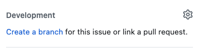

<h1 align="center">Exercise App</h1>
<div align="center"></div>

Description here


The learning objectives for this project:
<ul>
  <li>Create the best user experience by displaying appealing views that are user friendly</li>
  <li>Create user authentication with login feature</li>
</ul>

Current functionality

- TBD

Possible next steps:

<br>

# Table of Contents
- [Flow of Application](#app-flow)
- [Tech & Tools Used](#tech-and-tools)
- [Contributing Guidelines](#contributing-guidelines)
- [Contributors](#contributors)
# Tech and Tools

  #### Built With
  -  **3.1.4**
  -  **7.0.8.1**
  - 
  <!-- -  -->
  - 
  - 
  -  **3.12.0**


#### Gems Used (as of 4/15/24):
  - [Capybara](https://github.com/teamcapybara/capybara)
  - [RSpec](https://github.com/rspec/rspec-metagem)
  - [Shoulda Matchers](https://github.com/thoughtbot/shoulda-matchers)
  - [Pry](https://github.com/pry/pry-rails)
  - [Figaro](https://github.com/laserlemon/figaro)

# App flow

- TBD


# Welcome Contributors

## Getting Started
- Clone this repository locally<br>
``` git clone git@github.com:Yuji3000/exercise_app.git ```
- If necessary, update to Ruby Version 3.1.4 
- Run ``` bundle install``` 
- Create and migrate the database<br>
 ``` rails db:{create,migrate}```
- To run the build process with TailwindCSS <br>
``` ./bin/dev``` <br>
If not using TailwindCSS ```rails s``` is ok


## Contributing Guidelines
To contribute:
* Identify an unassigned issue
* Only work on one issue at a time
* Ensure that the application runs locally in your browser. When you run the test suite locally, it should pass
* To create a new branch, go to the Github issue of your choice and click on "Create a branch" and follow the instructions
 
* Make code changes related to the assigned issue
* Commit locally using descriptive messages that indicate the affected parts of the application
* Add tests related to your work(most of the time)
* Ensure all tests pass successfully; if any fail, fix the issues causing the failures
* Make a final commit if any code changes are required
* Push up the branch
* Create a pull request and fill out the description fields


# Contributors

<table>
  <tr>
    <td></td>
  </tr>
  <tr>
    <td><strong>Yuji Kosakowski</strong></td>
  </tr>
  <tr>
    <td>
      <div align="center"><a href="https://github.com/Yuji3000">GitHub</a><br>
      <a href="https://www.linkedin.com/in/yujikosa/">LinkedIn</a></div>
    </td>
  </tr>
</table>


